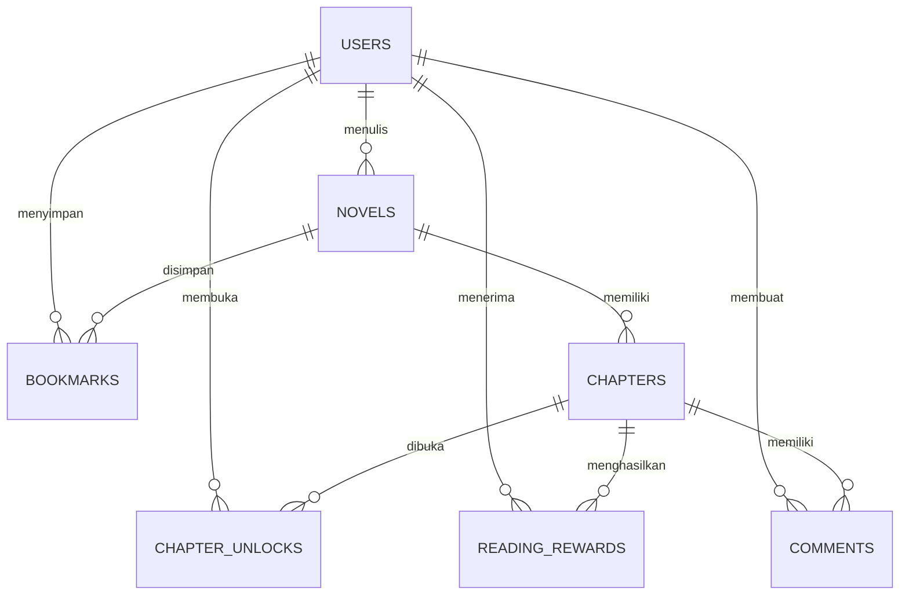
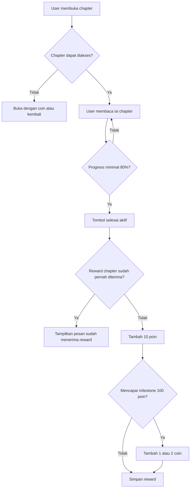
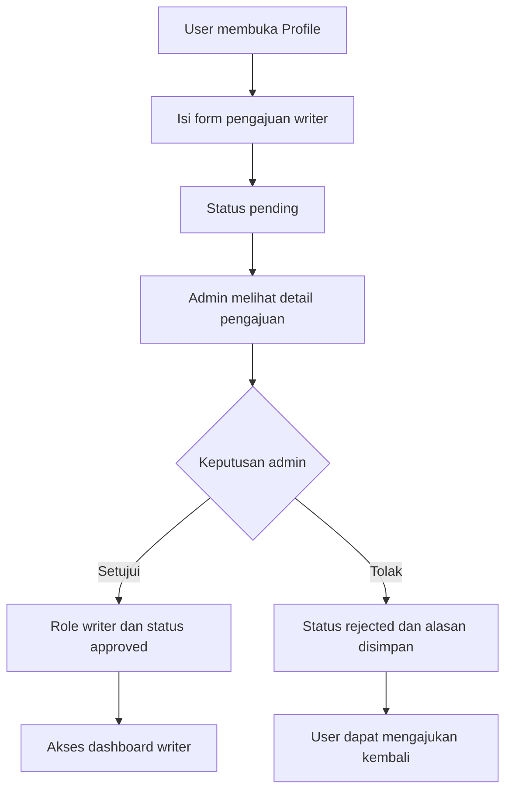

# NovelKu - Dokumentasi Project

## Identitas

- Nama: Sebastian Botu
- Kelas: XII RPL 1
- Sekolah: SMK Wahidin Kota Cirebon

## Ringkasan

NovelKu adalah platform membaca dan publikasi novel berbasis Laravel. Aplikasi ini memiliki area publik untuk pembaca, dashboard writer untuk membuat konten, dan dashboard admin untuk mengelola pengguna, novel, chapter, laporan, serta pengajuan writer.

## Teknologi

- PHP 8.2
- Laravel 12
- MySQL; SQLite digunakan untuk testing
- Blade, CSS, JavaScript
- Laravel Breeze
- barryvdh/laravel-dompdf
- PHPUnit

## Fitur

### Pembaca

- Registrasi, login, logout, reset password
- Katalog novel dengan pencarian judul, sinopsis, atau nama penulis
- Filter genre dan status novel
- Sorting terbaru, populer, dan paling disukai
- Reader dengan pengaturan ukuran font dan tema
- Bookmark, like, rating, komentar, dan laporan komentar
- Download chapter dalam bentuk PDF
- Pengajuan menjadi writer dari halaman Profile
- Sistem reward membaca dengan poin, level, dan coin
- Chapter premium yang dapat dibuka menggunakan coin

### Writer

- Dashboard writer
- CRUD novel milik sendiri
- CRUD chapter milik sendiri
- Pengaturan chapter premium dan harga coin
- Statistik novel, chapter, dan views

### Admin

- Dashboard statistik
- CRUD novel dan chapter
- Manajemen user dan role
- Pencarian/filter user
- Review pengajuan writer
- Persetujuan atau penolakan writer
- Manajemen laporan komentar
- Data novel bawaan melalui DatabaseSeeder

## Sistem Reward

1. User membuka chapter yang dapat diakses.
2. User membaca sampai minimal 80%.
3. Tombol `Tandai Chapter Selesai` menjadi aktif.
4. User memperoleh 10 poin.
5. Satu chapter hanya dapat memberi reward satu kali.
6. Setiap 100 poin memberi 1 coin dan milestone berikutnya memberi 2 coin secara bergantian.
7. Level dihitung dari total poin membaca.

## Sistem Pengajuan Writer

Pengajuan dilakukan melalui Profile. User mengisi email pengajuan, motivasi, pengalaman, genre, dan persetujuan. Status menjadi `pending`. Admin dapat melihat detail pengajuan dari Dashboard atau halaman Pengajuan Writer, kemudian memilih approve atau reject. Saat approve, role user menjadi `writer` dan status menjadi `approved`.

## Struktur Teknis

- `app/Models`: model database
- `app/Http/Controllers`: logika aplikasi
- `app/Http/Middleware`: pembatas akses admin dan writer
- `resources/views`: tampilan Blade
- `database/migrations`: struktur database
- `database/seeders`: data demo
- `routes/web.php`: route aplikasi
- `tests/Feature`: pengujian alur utama

## ERD Sederhana



Tabel utama terdiri dari `users`, `novels`, `chapters`, `reading_rewards`, `chapter_unlocks`, `comments`, `bookmarks`, `likes`, `ratings`, `reports`, dan `notifications`.

## Flowchart Reward Membaca



## Flowchart Pengajuan Writer



## Checklist Demo

- [ ] Database sudah dijalankan dan novel bawaan tampil.
- [ ] Halaman login dan register dapat dibuka.
- [ ] User dapat membaca chapter dan menyelesaikannya.
- [ ] Poin dan coin bertambah sesuai milestone.
- [ ] User dapat mengajukan writer dari Profile.
- [ ] Admin dapat melihat detail dan memproses pengajuan writer.
- [ ] Writer dapat membuat novel dan chapter.
- [ ] Admin dapat mengelola novel, user, dan laporan.
- [ ] PDF dokumentasi dapat diunduh dari `/documentation/pdf`.

## Instalasi

```powershell
composer install
copy .env.example .env
php artisan key:generate
php artisan migrate
php artisan db:seed --class=DatabaseSeeder
php artisan serve
```

Atur koneksi database pada `.env` sebelum menjalankan migration. Dokumentasi PDF tersedia dari route publik `/documentation/pdf`.

## Pengujian

```powershell
php artisan test
```

Pengujian mencakup autentikasi, novel, reader, writer, admin, pencarian katalog, dan sistem reward.

## Catatan Keamanan

- Jangan menaruh password akun demo atau secret key di dokumentasi publik.
- Jangan mengunggah file `.env` ke repository publik.
- Untuk deployment, matikan `APP_DEBUG`.
- Gunakan HTTPS jika aplikasi diakses melalui internet.